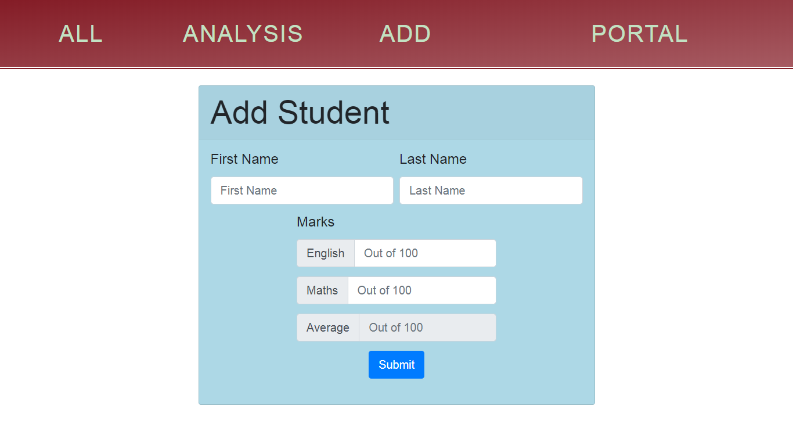
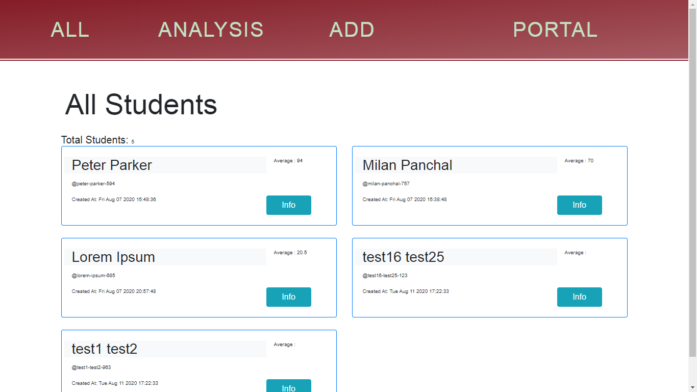
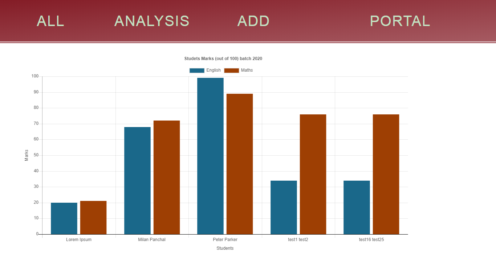
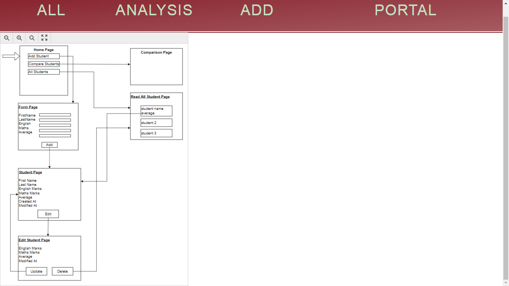

# Student Portal
A micorservice which maintains students information. Students can create their profile, add marks, **analyse** their performance with peers and delete their profile. Service don't use and database so **your data will be deleted if page reloads or if server is shutdown** 

## Installation

Use the node package manager to install required packagex

```bash
npm install
```

## Run

```bash
npm run start
```

## NOTE:
Initial URL: 
```
  127.0.0.1:3000/home
```

## Technology Stack
NodeJs


# Pictures





# References:

1. [Markdown Cheet Sheet]('https://github.com/adam-p/markdown-here/wiki/Markdown-Cheatsheet')

2. Learned about "Headers" from [this]('https://www.smashingmagazine.com/2018/01/understanding-using-rest-api/' 'Anatomy of A Request') article to use [REST Client]('https://marketplace.visualstudio.com/items?itemName=humao.rest-client' 'VS Code plugin') for sending Requests.

3. [Bootstrap Cheet Sheet]('https://hackerthemes.com/bootstrap-cheatsheet')

4. [Adding CSS to EJS]('https://stackoverflow.com/questions/18629327/adding-css-file-to-ejs')
5. [Bootstrap Spacing]('https://getbootstrap.com/docs/4.4/utilities/spacing/')
6. [Event in js]('https://www.geeksforgeeks.org/html-oninput-event-attribute/')
7. [Event in js]('https://javascript.info/events-change-input#:~:text=Event%3A%20input,recognition%20to%20dictate%20the%20text.')
